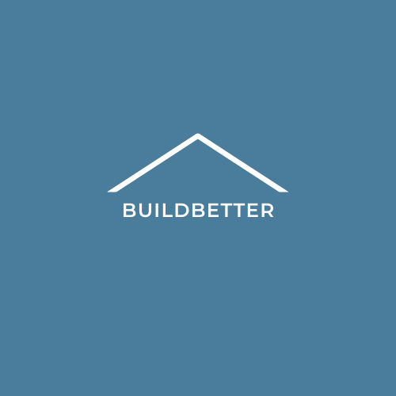

# BuildBetter by tele2nies
<p align="center">
  
</p>

# Project Overview:
Poor housing in developing countries can lead to severe consequences, and this is due to the lack of information regarding safe housekeeping. BuildBetter aims to help families in developing countries identify potential house hazards to create a safe, resilient and sustainable environment for them. By keeping them informed of dangerous hazards and allowing them to contact contracters to help them, our users will be equipped with the necessary knowledge on safe housekeeping, improving their health and well-being in the long run. We hope to address the following Sustainable Development Goals with our application.
<br>
<span align = 'center'>


</span>


# What it does:
BuildBetter is a mobile application that allow users to identify potential hazards and  risks by simply scanning their house using their movile device. Once the scan is completed, users will be notified of the risk level and can contact the relevant contracters for assistance. They are also able get an overview of their on-going jobs with contracters.

# Technologies used:
* Google Cloud Vision AI
* Google Cloud IOT
* Firebase
* Google Cloud
* Google Meet


# todo: 
* frontend stuff
* integration stuff
* backend to do: check if "dangerous item" close to edge, (other possible dangerous scenarios)

## hackfestBE API endpoints
* **URL: ** /get_labels/
* **Method: ** `GET`
* **Required Params: ** `image encoded in base64 format`
* **Sample Response: **  returns a json with code and features in the picture
```
{
    "code": 200,
    "data": {
        "Cat": {
            "bottom_left": [
                0.2858941853046417,
                0.17550413310527802
            ],
            "botton_right": [
                0.7382640838623047,
                0.17550413310527802
            ],
            "name": "Cat",
            "top_left": [
                0.2858941853046417,
                0.9805750250816345
            ],
            "top_right": [
                0.7382640838623047,
                0.9805750250816345
            ]
        },
        "Furniture": {
            "bottom_left": [
                0.8298903107643127,
                0.08395647257566452
            ],
            "botton_right": [
                0.9973958134651184,
                0.08395647257566452
            ],
            "name": "Furniture",
            "top_left": [
                0.8298903107643127,
                0.9858327507972717
            ],
            "top_right": [
                0.9973958134651184,
                0.9858327507972717
            ]
        }
    }
}
```

